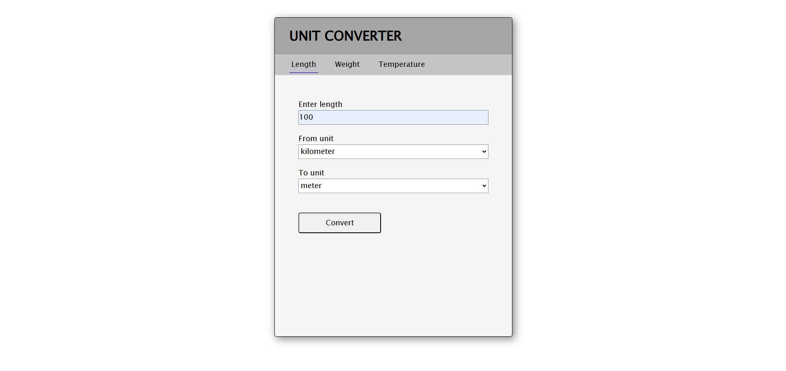
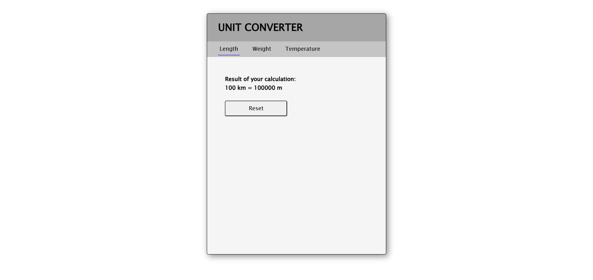

# [COMPLETE] Unit Converter Web App

A simple web app that can convert between different units of measurement. It can convert units of length, weight and temperature. The user can input a value and select the units to convert from and to. The application will then display the converted value.

### Technologies Used:
1. Frontend: HTML, CSS and JS
2. Backend: Java, Springboot, Apache Tomcat
3. Source code management: Git, GitHub, Maven

### Installation
1. Clone the repo
```bash
git clone git@github.com:avinashee0012/UnitConverterWebApp.git
cd UnitConverterWebApp
```
2. Run war file
```bash
java -jar unitconverterwebapp-1.0.war
```
3. Visit http://localhost:8080/

NOTE:
If port 8080 is busy, another port will be used and can be found from terminal logs (see example below):


### Usage Example
1. Visit the tabs as needed.
2. Fill the form

3. See the result

_____

Future Releases:
####
Project Idea: [roadmap.sh](https://roadmap.sh/projects/unit-converter) 